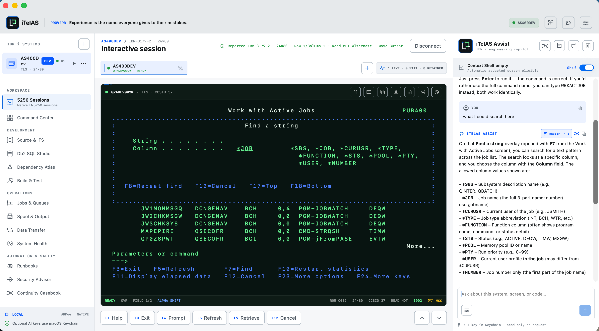

# iTelAS

iTelAS is an original, native macOS workbench for IBM i professionals. It starts with a functional Apple Silicon SwiftUI application, a clean-room TN5250 protocol foundation, an opt-in AI assistant, and a product architecture for bringing development, operations, output, data movement, health, automation, and security work into one coherent tool.

The interface is organized around work and urgency rather than a conventional terminal-client menu structure.

## iTelAS in action

[](docs/images/itelas-interactive-session.png)

An active IBM i session with native terminal controls and contextual, operator-reviewed assistance.

## What works in this milestone

- Native SwiftUI app for Apple Silicon Macs running macOS 15 or newer.
- Multi-session TN5250 terminal with TLS, 24×80 and 27×132 displays, supported single-byte EBCDIC CCSIDs, field-aware editing, PF keys, reconnect handling, history, export, print, and accessibility.
- Session profiles, a universal command palette, guarded diagnostic staging, and operator-reviewed recording and macros.
- Workbenches for Source and IFS, Db2 SQL and export, compile evidence, jobs, spool, transfers, health, dependencies, runbooks, authority, and incident handoffs.
- Bounded Db2 and SSH/SFTP integrations, with production mutation blocked or explicitly reviewed.
- Opt-in OpenAI-compatible assistance with Keychain credentials, redacted context, request receipts, and local proposal review.
- Security-first defaults: no automatic command execution, no silent AI sends, host-key pinning, and sensitive-field redaction.
- See [compatibility evidence](docs/COMPATIBILITY.md) and the [security model](docs/SECURITY.md) for exact capabilities and limitations.

## Build from source

### Requirements

- An Apple Silicon Mac.
- macOS 15 or newer.
- Xcode with the Swift 6.2 or newer toolchain.
- Xcode Command Line Tools selected with `xcode-select`.

### Clone the repository

```sh
git clone https://github.com/bellchu/iTelAS.git
cd iTelAS
```

### Run during development

```sh
swift run --disable-sandbox
```

### Run the tests

```sh
swift test --disable-sandbox --scratch-path /tmp/itelas-build-tests
```

The live PUB400 integration test is opt-in; the normal suite does not contact an IBM i host or load the ignored development credential file.

### Build the macOS application

```sh
./scripts/build-app.sh
```

The build script creates an Apple Silicon application at `dist/iTelAS.app`. Open the output folder and drag the app into Applications if desired:

```sh
open dist
```

This is an ad-hoc-signed local development build. Redistributing the app to other Macs without Gatekeeper warnings requires an Apple Developer ID signature and Apple notarization.

## Product boundaries

This is a strong, runnable foundation—not yet a production replacement for IBM i Access Client Solutions. A real IBM i compatibility lab is required before claiming host coverage. The next required protocol work includes remaining 5250 orders, extended text/ideographic attributes, optional FCWs such as check-digit, self-check, and cursor progression, full format-table behavior, full TN5250E coverage, DBCS and bidi presentation semantics, 5250 printer sessions, and broader host-backed integration tests. Local screen PDF/printing is implemented; it is not a 5250 printer-device session.

The native Db2 transport is compiled and contract-tested but has not been exercised against an IBM i host on this Mac because unixODBC and the licensed IBM driver are absent. Source Member, Jobs & Queues, Spool & Output, Data Transfer, System Health, Dependency Atlas, and Authority Path Atlas therefore ship with local replays while their live paths remain unverified against a real IBM i release and authority matrix. Source Intelligence is deliberately a bounded local navigation aid, not a compiler, preprocessor, include resolver, or promise of semantic correctness. Spool preview currently preserves ordered text records rather than page layout, AFP, or IPDS fidelity. Data Transfer currently accepts bounded UTF-8 CSV and validates against a read-only target schema; XLSX/ODS ingestion, IFS-backed staging, and every transfer write remain future reviewed capabilities. System Health reports a transparent local heuristic—not an IBM score—and treats `SYSLIMITS` rows as high-water occurrences rather than trends. Dependency Atlas reports only direct collected evidence and explicit gaps; it does not claim runtime frequency, transitive completeness, or change safety. Authority Path Atlas explains caller-visible static rows and observed authority checks without claiming a complete effective-authority calculation, collection coverage, or safe remediation. Runbook Flight Deck resolves local review plans only: its attestations are not authenticated signatures, its evidence entries are requirements rather than collected proof, and it cannot contact or change a host. Continuity Casebook snapshots are local handoff evidence rather than authenticated approvals or current host state; exported manifests may contain sensitive operational or source material and remain the operator's custody responsibility. The broader workbench still needs source-member host qualification, non-UTF-8 IFS conversion, explain-plan/result export, a reviewed remote compile collector with EVFEVENT expansion remapping, and broader release-aware authority coverage. See [product scope](docs/PRODUCT.md), [architecture](docs/ARCHITECTURE.md), [compatibility evidence](docs/COMPATIBILITY.md), and [security model](docs/SECURITY.md).

## Reference basis

iTelAS uses published protocols and public product behavior as references. Its Swift source, interface, menu structure, and assets are original. See [research notes](docs/RESEARCH.md) and [reference notice](THIRD_PARTY_NOTICES.md).

## License

iTelAS is available under the [MIT License](LICENSE).
